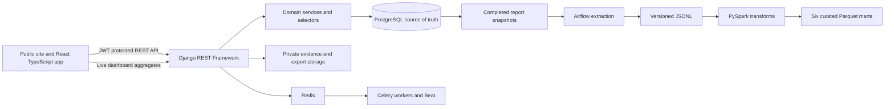
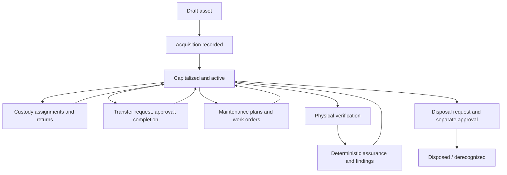

# AssetFlow

**A fixed asset management platform for the full operating and accounting lifecycle.**

AssetFlow helps finance and operations teams keep asset records, accounting state, custody, maintenance, physical verification, and approvals connected. It is built with Django REST Framework, PostgreSQL, React, and TypeScript, with Celery for application background work and a separate Airflow/PySpark analytics pipeline.

**IAS 16-aligned fixed-asset workflows** is a description of the design direction, not a claim of complete IAS 16 or IFRS compliance.

## Why AssetFlow exists

Fixed asset records often become fragmented across spreadsheets, accounting workbooks, maintenance tools, and physical count documents. That makes it difficult to reconcile what an organization owns, where assets are placed, who has custody, what value has been depreciated, and which exceptions need review.

AssetFlow models those responsibilities as connected, auditable workflows. Accounting state remains distinct from operational events, and control findings do not silently rewrite asset master data.

## What it does

The application covers:

- Asset register, categories, organization departments and locations.
- Componentized acquisition costs and controlled capitalization.
- Straight-line depreciation schedules, open accounting periods, and posted ledger entries.
- Custody assignments, placement transfers, maintenance work, and disposal approval.
- Physical verification observations, verification exceptions, private binary evidence, and deterministic assurance.
- Live operational dashboard, current reports, durable report snapshots, and private CSV/JSON exports.
- Organization-scoped audit history and a separate Airflow/PySpark path for curated analytics.

## Architecture



PostgreSQL is the transactional authority. The operational dashboard reads bounded live Django aggregates. Durable reports and exports use snapshots. Airflow and Spark process snapshot-derived datasets separately; the browser does not read Parquet.

## Fixed asset accounting

Acquisition components are added by the backend using Decimal arithmetic. Capitalization establishes the asset's cost basis and initial book value. The implemented depreciation method is straight-line (SLM): a schedule begins in the calendar month containing the available-for-use date, without daily proration. Entries post sequentially into open accounting periods. Values use two-decimal currency precision and ROUND_HALF_UP; the final scheduled entry absorbs prior rounding remainder and book value cannot pass below residual value.

Disposal snapshots accounting balances and records proceeds, carrying amount, and gain or loss through a controlled approval/completion workflow. See [the accounting guide](docs/accounting.md) for a worked example and boundaries.

## Asset lifecycle



Lifecycle status and accounting history are related but not interchangeable. Assignments control custody; completed transfers control placement. Verification and assurance record control evidence and findings without automatically changing asset master or accounting values.

## Assurance, reporting, and analytics

Assurance captures versioned run inputs, evaluates durable work units, keeps candidate findings internal, and publishes public findings atomically after successful evaluation. Users review or resolve published findings through backend domain actions.

The reporting surfaces have different meanings:

- **Dashboard:** current operational aggregates.
- **Live report:** current query result.
- **Snapshot:** durable ordered report rows captured at a point in time; its as-of value is capture time, not arbitrary historical reconstruction.
- **Export:** CSV or JSON rendered from a completed snapshot and retrieved through an authenticated private endpoint.
- **Analytics mart:** batch-curated data derived from completed snapshots.

See [assurance architecture](docs/F8-assurance-reconciliation.md), [reporting and exports](docs/F9-reports-snapshots-exports.md), and [the analytics pipeline](docs/analytics.md).

## Security and governance

Implemented controls include JWT authentication, server-side organization and role authorization, department-scoped access where the domain policy requires it, backend-controlled workflow transitions, application audit history, and authenticated access to private evidence and exports. Private evidence and export content is size/hash checked on storage readback.

This project does not claim MFA, SSO, immediate JWT revocation, malware scanning, a cryptographic audit ledger, security certification, or production penetration testing. Security details and limitations are in [the security guide](docs/security.md).

## Technology

**Application:** Python, Django, Django REST Framework, PostgreSQL, React, TypeScript, TanStack Query, Vite.

**Background and data:** Celery, Redis, Airflow, PySpark, Parquet.

**Packaging:** Docker and Docker Compose.

## Engineering highlights

- Domain services keep accounting and state transitions out of serializers and UI components.
- PostgreSQL transactions, row locks, and uniqueness/check constraints protect consequential writes.
- Money crosses the API as exact decimal strings; the browser does not calculate accounting truth.
- Custody, placement, maintenance, verification, assurance, and accounting remain separate domain records.
- Snapshots freeze report rows; exports never rerun the live report.
- Non-idempotent frontend writes are not automatically retried; ambiguous outcomes are reconciled against Django.
- User/session-generation query scoping prevents prior-session data from appearing after a user switch.
- Public/authenticated application routes and feature screens are split into lightweight route bundles.

See [engineering decisions](docs/engineering-decisions.md) and the [technical case study](docs/portfolio-case-study.md).

## Release evidence

At the F16 release gate, the repository had **231 frontend tests across 21 files** and **370 PostgreSQL-backed Django tests passing**. Typecheck/lint, mock and Django builds, Django checks, migration drift checks, OpenAPI validation, Ruff, Python compilation, and npm audit passed. A disposable end-to-end golden lifecycle used the TypeScript repositories over HTTP against Django and PostgreSQL.

These are F16 results, not a promise that counts remain unchanged on later commits. The complete record and limitations are in [F16 release evidence](docs/F16-full-system-release-gate.md) and the concise [release evidence summary](docs/release-evidence.md).

F15 measured the authenticated App chunk shrinking from 605.50 kB to 102.56 kB (24.87 kB gzip), with the largest route around 80.65 kB. Bundle size is not a production throughput or scale benchmark.

## Quick start

### Prerequisites

- Git
- Docker Engine and Docker Compose v2
- Node.js 22 or later and npm, for running the Vite frontend outside containers
- Python 3.14 and PostgreSQL 17, for running Django directly outside containers

### Docker development stack

1. Clone the repository and enter it:

   ```sh
   git clone https://github.com/CrystalViiva/assetflow-fixed-asset-management.git
   cd assetflow-fixed-asset-management
   ```

2. Copy `.env.example` to `.env`.
3. Set a unique local `POSTGRES_PASSWORD` and generate a fresh `DJANGO_SECRET_KEY`; never reuse the example values outside local development.
4. Start the backend dependencies and application:

   ```sh
   docker compose up --build
   ```

   The web container applies migrations at startup in this single-instance development stack. PostgreSQL and Redis use Compose-managed volumes. The API is at `http://localhost:8000`; the health endpoint is `/api/v1/health/`.

5. For the frontend in another terminal:

   ```sh
   npm ci
   npm run dev
   ```

   The Vite server is available on port 3000. Set `VITE_DATA_SOURCE=mock` for the fictional local demo, or `VITE_DATA_SOURCE=django` with `VITE_BACKEND_API_URL=/api/v1` to use the authenticated API through the Vite proxy.

The mock interface is useful for visual exploration. It uses fictional demo records, is not live tenant data, and is never a fallback for Django mode. A built-in Django demo organization/user seed flow is not provided. First-organization bootstrap for a private installation is documented in [deployment](docs/deployment.md).

For the deployment-oriented Compose topology and private storage requirements, see [deployment](docs/deployment.md). The optional Airflow/Spark development profile is separate and described in [analytics](docs/analytics.md).

## API and contributor commands

- OpenAPI schema: `http://localhost:8000/api/v1/schema/`
- Swagger UI: `http://localhost:8000/api/v1/docs/`
- ReDoc: `http://localhost:8000/api/v1/redoc/`
- API namespaces include auth, assets/acquisitions, depreciation, assignments/transfers, maintenance, disposals, verification/evidence, assurance, reports/snapshots/exports, audit, organization administration, and dashboard metrics.

From the repository root:

```sh
npm ci
npm test
npm run typecheck
npm run lint
npm run build
python -m pip install -r backend/requirements.txt
python backend/manage.py check
python backend/manage.py makemigrations --check --dry-run
pytest
ruff check backend
ruff format --check backend
```

The Django test suite requires PostgreSQL; see [the API guide](docs/api.md) and [deployment guide](docs/deployment.md) for database configuration and release migration steps.

## Project structure

- `backend/` — Django apps, domain services, selectors, API, migrations, and tests.
- `src/` — React application, API repositories/DTOs, screens, and frontend tests.
- `airflow/` — batch extraction DAG.
- `spark/` — typed PySpark transformations and tests.
- `docs/` — architecture, domain rules, security, deployment, release evidence, and portfolio material.
- `scripts/` — isolated API smoke runners; these require an explicitly configured disposable database.

## Known limitations

SLM is the only implemented depreciation method. There is no component depreciation, estimate-revision workflow, IAS 36 impairment ledger, decommissioning obligation accounting, or multi-currency accounting. There is no generic asset document store, malware scanning, MFA/SSO, or immediate JWT revocation. F16 did not validate a live Airflow scheduler, Spark cluster, browser-rendered screenshots, or production-scale load.

## Documentation

- [Architecture](docs/architecture.md) · [Engineering decisions](docs/engineering-decisions.md) · [Business rules](docs/business-rules.md)
- [Accounting](docs/accounting.md) · [Security](docs/security.md) · [Deployment](docs/deployment.md)
- [Assurance](docs/F8-assurance-reconciliation.md) · [Reports and exports](docs/F9-reports-snapshots-exports.md) · [Data pipeline](docs/analytics.md)
- [F16 release evidence](docs/F16-full-system-release-gate.md) · [Portfolio case study](docs/portfolio-case-study.md) · [Interview guide](docs/interview-guide.md) · [Resume bullets](docs/resume-bullets.md)

## License

No project license file is present. The repository does not specify reuse terms; contact the project owner before redistributing it.
